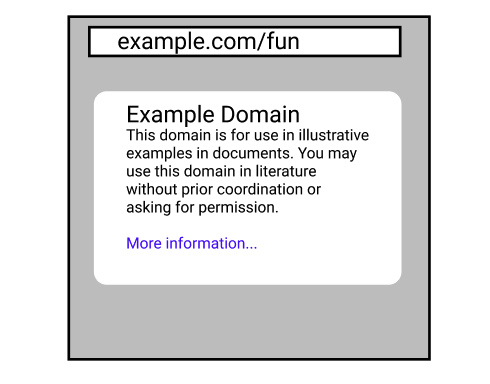
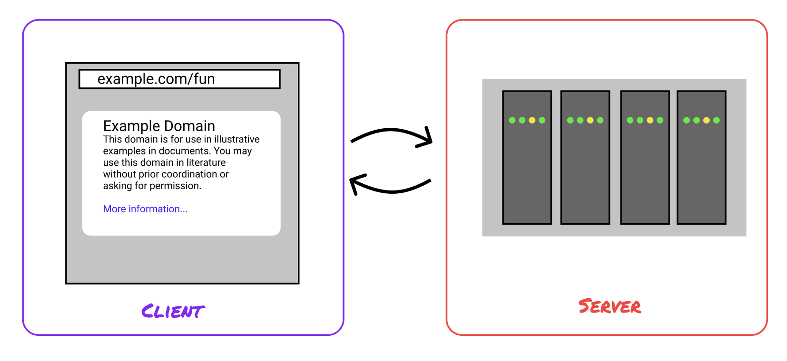
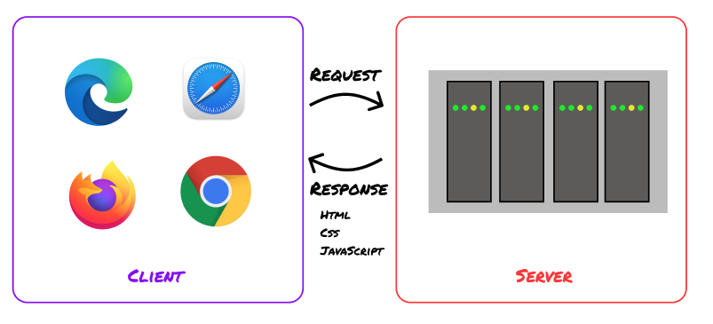
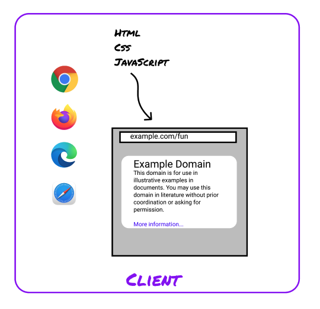

# Welcome to WEB 1.0

This course is Web Foundations. It's about HTML, CSS, and JavaScript, the foundational technologies
of the web.

In the first few pages, you'll learn what this course covers, who it's for, and what to expect.

## The Big Picture

Let's start with a simplified model of how the web works. Then we'll connect that to what you'll
learn in this course.

## The Web You Know

You are already familiar with the internet - you're using it right now!

You visit websites by tapping a link or searching something in the box at the top of the window,
then look at the content that's there. You can do all kinds of things - send messages, write posts,
shop, watch videos, or read tutorials.

So far, you've experienced the internet as a _user_. This course is about looking deeper at how some
of the core technologies come together to make those experiences work.

## One Step Deeper

Let's take our first look at how the web works.

When you pull up a website, your computer or phone connects to another computer through a network.
It makes a request to that computer for some files - the website you want to see. The other computer
(called a server) sends back the files to your computer. Then, your computer shows you those files.

Front end development is about the files that get shown. Web programmers learn how to put the right
stuff in those files so that the users of the site see what the programmers want.

What's in those files? Primarily, HTML, CSS, and JavaScript (though as we'll see, there's more
too!). Your web browser - the program on your computer or phone that you use to view websites, like
Safari, Opera, Firefox, or Chrome - speaks HTML, CSS, and JavaScript.

When the browser sees files written in these web languages, it follows a known set of rules for
displaying the files as a website. Front end developers learn those rules, so that they can write
HTML, CSS, and JavaScript that the browser understands and displays the way they want.

In this course you'll learn what the browser does with HTML, CSS, and JavaScript files when it loads
a page. Knowing that, you'll be able to build websites like the ones you've seen around the
internet - pages with infinite scrolling feeds, with article formats, with cool-looking layouts,
with inputs that respond to the user's actions.

**Reality has a surprising amount of detail.**

The web is much more complicated than the picture we've shown here! Hardware and software have to
work together to connect people with different devices to networks across the world. Browsers do
tons of complicated processing under the hood.

But, this picture should be enough for now, enough for us to get started.

## How is the course organized?

We're so excited that you're here to learn.

If you look at the navigation sidebar, you'll see that the course is split into 10 different
_topics_. Each topic covers introduces new material, lets you practice, and has an opportunity to
build something.

Since HTML, CSS, and JavaScript are all connected, the content follows a _spiral_. Instead of
learning all of HTML, then all CSS, then all JavaScript, the course winds back and forth between the
languages.

Each topic in the course builds on the others. The course assumes that you'll move through the
topics one after the other. But, if you already know some of the early material, or you're curious
about what's at the end, you can browse ahead too.

If you already know some of the concepts:

- You can skip ahead
- The material builds on itself. You need to know the previous content to move forward
- The projects and review questions are a quick way to check your own knowledge
- So, one strategy is to just do the projects, questions, and exercises. Then, go back through the
  other materials when you get stuck

If you are just getting started with the concepts - amazing! You can click through each page one by
one. In the lessons, you'll learn what you need for the exercises and projects, where you'll get a
chance to put what you learn into practice.
