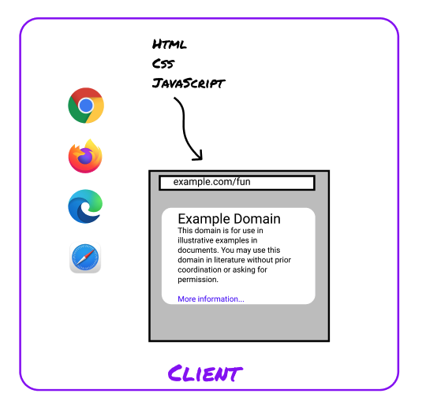

# What The Course Is About

This course will cover the basics of HTML, CSS, and JavaScript. You'll learn some of the rules the
browser follows, and you'll practice using what you learn to make websites.

**HTML** is the syntax for the structure and content of web pages. It's what a page is made of.

**CSS** styles the page. Using CSS, you can customize everything about how the content is displayed,
from color and font to animations and hover effects.

**JavaScript** lets you write instructions for the browser to follow. We're going to focus on using
JavaScript to make pages interactive. We'll write the steps that the browser should follow when the
user clicks a button or fills out a form.

HTML, CSS, and JavaScript are big and complicated. There's more than 100 HTML tags to learn, with
hundreds more attributes. There's a few hundred CSS properties and their possible values. JavaScript
is relatively smaller, keyword-wise - there's only 64 reserved words. But, as you'll find when we
start the JavaScript section, the language takes a lot more practice to learn to use well.

In this course, we won't cover everything about these languages. We're going to focus on what you
need to know to start building creative projects. We'll also focus on concepts that give you
_leverage_ - the skills and ideas that show up time and time again, and which make learning other
ideas easier.

## Which concepts will we focus on?

- HTML and CSS Syntax
- CSS Selectors
- JavaScript fundamentals
- Developer tools, skills, habits, and mindset

Why these?

**Syntax** means the rules of a language. In programming, those rules determine what code is valid.
Learning the syntax for HTML and CSS is the key for building websites, both in this course and in
the future. It will let you read code to understand how it works, write code of your own, and
recognize and fix errors. Many beginner errors are syntax errors. The syntax also gives you a
framework for learning and understanding more. Once you've learned how HTML tags work in general,
learning any individual tag will be easier.

This will also help with 'learning a syntax' in general. As you grow as a developer, you'll end up
learning lots of different syntaxes.

**CSS Selectors**, while somewhat arcane, give you a ton of power. They help you think about the
structure of your HTML. They let you target specific sets of elements with particular styles.
JavaScript also lets programmers use CSS selectors to find elements on the page for manipulation.

**JavaScript fundamentals** includes core programming concepts like variables, data types,
conditional statements, loops, and functions, as well as topics that are particular to web
development: selecting & modifying elements, responding to events, and sending requests to the
server. We're leaving a lot out - there's a lot more JavaScript to learn once you are comfortable
with these concepts. We're focused on these because they're common programming patterns that set you
up to learn other programming languages, and because with these skills in hand, you can build any
website (that doesn't do server stuff).

**Developer tools** power up your learning process, and they speed up your development workflow.
Professional developers use tools to understand, debug, and improve websites - or to see how another
developer built something.

## What this course doesn't cover

- Backend programming
- JavaScript frameworks
- Design

This course about the client side of how the web works, not the server side.

We're not going to talk (much) about what happens on the server or in the network. We'll make sure
to cover enough so that you can publish your sites so other people can see. However, there's some
features that you won't be able to build until you've learned more about backend programming -
programming for the server.

In this course, we're also not going to cover everything about JavaScript - not even all of the core
language! JavaScript more than a language - it's also a huge ecosystem of libraries, tools, and
other people's code. We're not going to learn React, Vue, JQuery, or Angular, or any of the hundreds
of other JavaScript tools you might or might not have heard of. As a frontend developer, you may end
up learning these tools down the road. Using any of them effectively requires a foundation of the
basics, which is what we're practicing here.

Making great websites takes knowledge, skill, and practice. It also takes _taste_. What color to
use? How big should the button be? What should the title say? Where should the link go? These are
hard questions, and we're not going to focus on them in this course. We want you to explore your
creativity and build sites that are beautiful, funny, effective, fun, important, and useful - and
that lots of people use! But, we won't cover design in this course. We'll learn enough of the tools
underneath that you should be able to build what you (or someone else) can think of and draw out.
