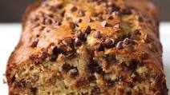

import HtmlDemo from '../HtmlDemo';
import BananaBread from './banana-bread.jpeg';

# What is HTML?

In the course intro, we learned that:

- **HTML** is for the structure and content of web pages.
- **CSS** is for styling the page.
- **JavaScript** is for controlling interactions.

HTML is a syntax for the structure and content of pages. It's made of letters and symbols that
follow some rules.

Let's see the example of what you'll build, then dig into the syntax.

## An HTML Recipe Site

Here's a preview of the type of site you'll build first.

<Exercise demo title="Recipe Page Demo" contentSrc="@makeschool2/Recipe-Page-Demo" />

It doesn't look incredible, but it gets the job done. When we learn CSS, we can improve how it
looks. By the end of this topic, you'll be able to write code for this kind of site from scratch.

## HTML Tags

<HtmlDemo>

```html
<p>This tender treat is a perfect use for any old bananas you have sitting on the counter.</p>
```

</HtmlDemo>

The HTML turns into a paragraph of text. This an HTML **element**: a single building block of a
webpage. Let's break down the parts of the syntax.

`<p>` is an HTML **tag**. It starts an element, and says what kind of element it is - in this case,
`p` is for a _paragraph_ element.

Each tag has an opening angle bracket `<`, then the name of the tag (like `p`), then a closing angle
bracket `>`.

`</p>` is a **closing tag**. It says "the paragraph ends here". Notice that it has a forward slash
`/`. Everything between the opening tag and closing tag are inside of the element.

Each **opening tag** needs to have a matching closing tag. Every `<p>` needs a `</p>`.

In between the opening and closing tags is some text:
`This tender treat is a perfect use for any old bananas you have sitting on the counter.` It's what
actually shows up on the page.

<TextResponse>
<Prompt>

Find the angle brackets on your keyboard and practice typing them.

</Prompt>
<Explanation>

On a US-style english keyboard layout, the angle brackets are on the comma (`,`) and period (`.`)
keys, towards the bottom right side of the keyboard. Hold shift and press `,` for the `<` character.
Shift + `.` for the `>` character.

The forward slash `/` is to the right of the key with `>` on it.

</Explanation>
</TextResponse>

## More HTML Elements

Here's another demo, with four new html elements.

<HtmlDemo replace={{
    /* replace img so that it gets a working (imported) image path, instead of the relative path */
    './banana-bread.jpeg': BananaBread,
  }}>

```html
<h1>Easy Chocolate Chip Banana Bread</h1>
<ul>
  <li>10 minutes prep time</li>
  <li>50 minutes bake time</li>
  <li>1 hr total</li>
  <li>Makes 6 servings</li>
</ul>

```

</HtmlDemo>

<TextResponse>
<Prompt>

What are the four new HTML elements you see in this example?

</Prompt>

<Explanation>

The four elements are:

- `h1`
- `ul`
- `li`
- `img`

</Explanation>
</TextResponse>

Let's learn about these elements.

`h1` is a _heading level one_ tag. It means the has the effect of making the text big. `h1` is the
biggest size heading, usually used for the title of the page. There's 6 levels of heading, with 6
tags, representing a smaller heading as the number goes up: `h1`, `h2`, `h3`, `h4`, `h5`, `h6`.

`ul` stands for _unordered list_. It makes a list. The list items inside each get a dot next to
them.

`li` is a _list item_. These are the elements in the list. Since they're between the opening and
closing tags the `ul` element, they appear inside the same list.

`img` is an _image_. It has a new syntax too: an attribute `src` for the source of the image. That
`src` is the location where the browser can find the image itself.

## Attributes

HTML elements sometimes need more info than just what kind of element they are. For example, the
browser needs to know the `src` of the image so that it knows what to show.

Attributes look like `src="./banana-bread.jpeg"` or `height="100px"`. They usually have a name, an
equals sign (`=`) then a value in quotes.

Attributes go after the tag name, but before the closing angle bracket of the opening tag.

Elements can have lots of attributes, or just one. There's a space between each one.

```html

```

## Nesting Elements

Elements can go inside other elements. We call this "nesting" - the _child_ element is nested inside
the _parent_ element.

```html
<ul>
  <li>10 minutes prep time</li>
</ul>
```

The list item (`li`) is the _child_ element of the unordered list (`ul`).

The nesting can go as many levels deep as we want:

```html
<ul>
  <li>
    <p>
      
    </p>
  </li>
</ul>
```

Elements have to be fully nested, they can't intersect. This is **invalid**:

```html
<ul>
  <li>
    10 minutes prep time.
  </ul>
</li>
```

We can see that the tags don't match up on the same lines, because we indented child elements deeper
than their parents.

## Rounding out the basic elements

There's two more elements you'll need for the recipe page.

The first is the ordered list, `ol`. It works just like the unordered list, but it's _ordered_. It
shows a number next to each list item.

<HtmlDemo>

```html
<ol>
  <li>Preheat oven to 350˚F (180˚C).</li>
  <li>
    In a bowl, add the bananas and mash until smooth. Add in the melted butter and stir until well
    combined.
  </li>
  <li>
    Add the sugar, egg, vanilla, baking soda, salt, and flour, and stir until the batter is smooth.
  </li>
</ol>
```

</HtmlDemo>

Last, the element that makes the web different from other kinds of documents: the link.

<!-- prettier-ignore-start -->
<!-- (otherwise, prettier will try to make the <a> example below fit on one line) -->

<HtmlDemo>

```html
<a href="https://www.nngroup.com/articles/hypertext-history/">
  The History of HyperText
</a>
```

</HtmlDemo>

<!-- prettier-ignore-end -->

The `a` stands for "anchor", which is a weird word for a link! Even weirder is `href`, the attribute
that tells the browser where to go when you click. It stands for "Hypertext reference". It's a
_reference_ - a pointer - to some other _HyperText_.

What's "Hypertext"? Well - all of the web. `HTML` stands for "HyperText Markup Language". The web is
made of hypertext - text with links to other text.

### What gets linked?

In the example, the link text was `The History of HyperText`.

```html
<a href="https://www.nngroup.com/articles/hypertext-history/"> The History of HyperText </a>
```

Anything that is nested between the opening and closing `<a>` tags will be linked.

For instance, we can link a header:

```html
<a href="https://replit.com/@makeschool2/Recipe-Page-Demo">
  <h1>Easy Chocolate Chip Banana Bread</h1>
</a>
```

or an image:

```html
<a href="https://replit.com/@makeschool2/Recipe-Page-Demo">
  
</a>
```

or a header and an image together:

<HtmlDemo>

```html
<a href="https://replit.com/@makeschool2/Recipe-Page-Demo">
  <h1>Easy Chocolate Chip Banana Bread</h1>
  
</a>
```

</HtmlDemo>

Clicking on anything in the link will navigate to the `href`.

## Elements Summary

Here's the elements we've learned so far:

- `p`
- `h1` through `h6`
- `ul`, `ol`, and `li`
- `img` (and the `src` attribute)
- `a` (and the `href` attribute)

<FlashCard>
<Prompt>

For each of these HTML Tags, what kind of element does it create?

- `p`
- `h1`
- `ul`
- `ol`
- `li`
- `img`
- `a`

</Prompt>
<Answer>

- `p` - paragraph
- `h1` - heading
- `ul` - unordered list
- `ol` - ordered list
- `li` - list item
- `img` - image
- `a` - anchor (link)

</Answer>
</FlashCard>

There's a lot more HTML elements. They all follow these syntax rules. To master the rules and these
elements, you'll need to practice building sites by writing HTML.

On the next page, you'll get to practice writing some HTML of your own.
