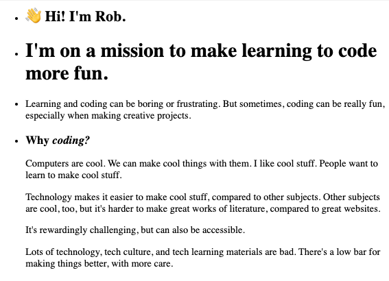
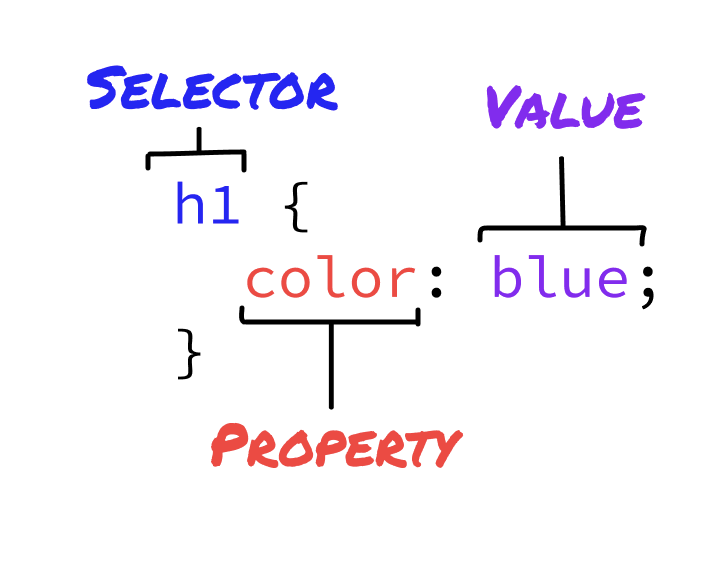

# What is CSS?

CSS stands for **Cascading Style Sheets**, and it's the language for styling web pages.

We're going to cover the basics:

- What CSS is for
- What CSS looks like
- The basic syntax for CSS rules

## What is CSS for?

You've seen that HTML lets you structure the content of your page. CSS lets you style that content.

Instead of sites that look like this:



You can make the same HTML look like this:


CSS lets you apply _properties_ to particular HTML elements.

<FlashCard
  prompt="Looking at the example, what are some properties that you think CSS lets you control?"
  answer="CSS lets you control font, color, and position (and a lot more)."
/>

## What does CSS look like?

CSS is about _rules_. Each rule is made of a _selector_ to choose which elements to style, and a
list of _properties_ and _values_.

Here's a whole rule:

```css
h1 {
  color: blue;
}
```

This rule says "make the `h1` elements have the `color` blue".

<Info>

**Where do you write CSS?**

We can put our CSS rules inside a `<style>` tag in our HTML. So, a complete version of the example
is:

```html
<style>
  h1 {
    color: blue;
  }
</style>
<h1>CSS Rules!</h1>
```

Later on, we'll see how to deal with multiple files, and we'll put our CSS in its own file.

</Info>

## CSS Syntax



A CSS rule is made of a selector and a block with properties and values.

A block starts with an opening curly brace `{` and ends with a closing curly brace `}`.

Properties (like `color` in this example) go inside the block, and their value goes after a colon
`:`. After the value comes a semicolon `;`.

There can be more than one property and value in a block.

```css
h1 {
  color: blue;
  font-family: Garamond;
  font-size: 32px;
}
```

Values take on lots of different forms. Here, we see a color as a name (`blue`), a font family name
(`Garamond`), and a font size in pixels (`32px`). As you learn more properties, you'll also learn
the values allowed for each property.

There can be more selectors in a rule, and there's more kinds of selectors:

```
h1, h2, .header {
  color: blue;
  font-family: Garamond;
}
```

That's the basics of CSS syntax. There's a ton more to learn about selectors, properties, and
values. Before you try to memorize it, we have some exercises so you can try to put it into
practice.

## What's next?

Next up, we have some exercises and a project to practice your basic CSS.

We'll also add styles to future demos and projects, even when styling isn't the focus. Now that you
have seen the basic syntax of CSS, you can read those styles to see what elements are selected, and
what property is being set to what value.
