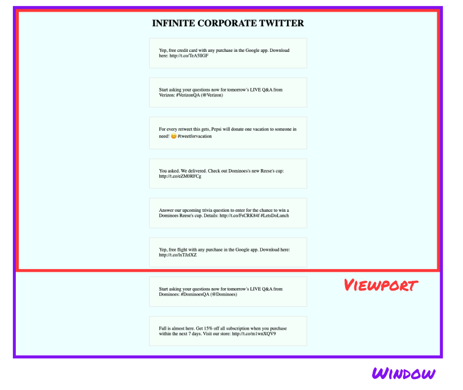
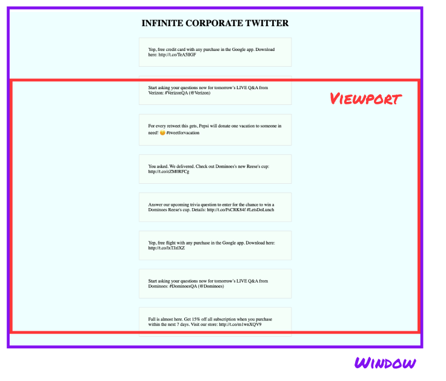

# Project: Infinite Scrolling Feed

On sites like Facebook and Twitter, the main view is a feed of content that pulls in more posts when
you scroll to the bottom. In this project, you'll take a newsfeed page and add JavaScript so that
the content has the same 'infinite scroll' effect.

You'll also practice using functions to generate content. In the demo, we generate random 'brand'
tweets. For your project, you can make your own version of the corporate twitter generators, or
think of your own idea for random generators. Poetry, news headlines, horoscopes... the
possibilities are infinite!

## Demo: Infinite Corporate Twitter

<Exercise demo contentSrc="@makeschool2/InfiniteScrollDemo" />

## Project Goals and Requirements

- Use functions to generate content
- Add new content to the feed when the scroll reaches the bottom of the screen
- Make separate files for HTML, CSS, and JS
- Write small functions (about 3 to 10 lines) and compose them to make the overall program. There's
  not a strict number of functions you have to use, but it would be surprising if you use fewer
  than 5.
- Use at least two loops (in the demo, we loop in the link generator and when adding lots of content
  at once)

Make it your own! Write content generating functions that are

## Mise En Place

Before you start coding, do your prep! You can write your notes in a document or on paper - wherever
is best for you.

Here's some things you'll need in your plan:

1. What content will you generate for your site?

Decide on the kind of content you're going to have in your feed. Come up with a few sample items,
either by searching for them or by writing them yourself.

2. Plan the content generator functions

Without writing the code, come up with a plan for how the functions will work. You might write
pseudocode or the big-picture steps that the code will follow to generate a new item.

3. Styles

The demo site's styles are pretty simple. You can use it as a starting point, or you can take your
own approach. As much as possible, pick your design elements before you get started coding.

4. Plan your code

You've practiced adding content to the page, and you've practiced writing functions that generate
text. The other feature of this project is loading more content **when the user scrolls to the
bottom of the screen**. How do you detect that with code? There's no easy event listener to add -
the browser doesn't have a 'scrollToBottom' event. Instead, there's a handful of other approaches.

Read more below about how to detect reaching the bottom of the screen.

### How to detect scroll reaching the bottom of the screen?

In the demo, we use an old school approach.

- Add an event listener for the 'scroll' event
- In the event listener callback, check if the view is at the bottom

How does 'check if the view is at the bottom' work? There's a few new properties and a little bit of
math involved.



The 'viewport' is the section of the window that shows on the screen. The 'window' is larget than
the viewport - it's got more content, that the user can scroll to see.



To tell if the bottom of the viewport is at the bottom of the window, we need to know:

- how tall the window is
- how tall the viewport is
- how far we've scrolled from the top of the window

These values are available as properties of the root element of the window, called
`document.documentElement`.

```js
document.documentElement.scrollHeight; // how tall the window is
document.documentElement.clientHeight; // how tall the viewport is
document.documentElement.scrollTop; // how far we've scrolled from the top
```


If `scrollTop` plus `clientHeight` is greater than or equal to `scrollHeight`, then we've scrolled
to the bottom.

```js
scrollTop + clientHeight >= scrollHeight; // are scrolled to the bottom?
```

One problem. Sometimes the browser gives a fractional number for `scrollTop`, so it doesn't quite
add up. So, in the demo, we add a "fudge factor" of 10 pixels. That means the page will detect the
bottom a little bit early, but for this site, that's okay.

```js
scrollTop + clientHeight >= scrollHeight - 10; // scrolled to the bottom, with fudge factor
```

<Info>

There's a newer approach using a new tool called an IntersectionObserver.

It's less familiar than the event listeners we've been using so far, but some of the same ideas
apply. See the
[MDN page on IntersectionObserver](https://developer.mozilla.org/en-US/docs/Web/API/Intersection_Observer_API).

IntersectionObserver can be used for a lot of different features, as demonstrated in this
[CSS Tricks blog post](https://css-tricks.com/a-few-functional-uses-for-intersection-observer-to-know-when-an-element-is-in-view/).

</Info>
